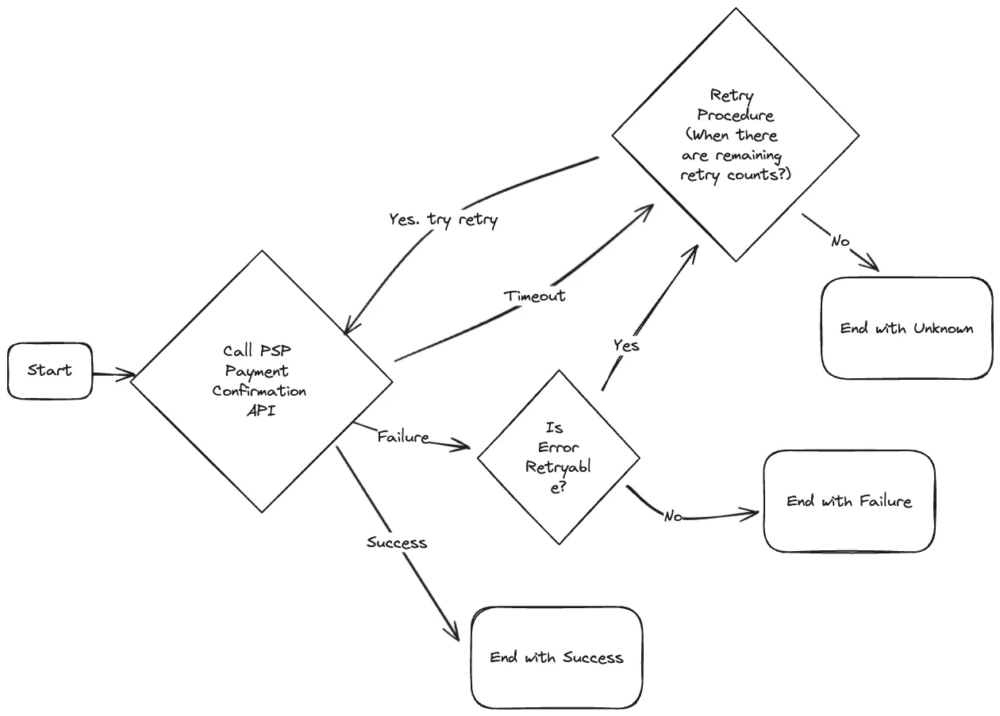

# Payment System

## 프로젝트 목표

이 프로젝트는 스타트업에서 진행했던 **결제 서비스 구축 경험**을 바탕으로 개인 프로젝트로 확장한 것이다.  
**아마존이나 쿠팡과 같은 온라인 전자상거래 플랫폼**에서 물건을 구매할 때 사용하는 결제 시스템을 직접 설계하고 구현하는 것이 목표다.

이를 통해 **온라인 상거래에서 필수적인 결제 프로세스를 이해**하고, 실제 서비스에서 활용될 수 있는 **결제 시스템의 아키텍처와 기술 스택**을 다룬다.

---

## Requirements 정의

결제 시스템을 구축하기 위한 주요 요구사항은 다음과 같다:

- **결제 방식**: Toss Payments의 **위젯 방식**을 사용하여 결제를 처리한다.
- **서비스 범위**: 글로벌 서비스가 아닌 **대한민국 내에서만 운영**되는 결제 시스템을 구축한다.
- **트래픽 고려 제외**: 트래픽 처리량에 대한 구체적인 제한을 두지 않는다.
- **보안 및 인증**: 사용자 인증이나 보안(Security)과 관련된 상세 요구사항은 포함하지 않는다.
- **신뢰성(Reliability)과 장애 허용성(Fault Tolerance)**: 일부 서비스에 장애가 발생하더라도 **결제가 올바르게 완료될 수 있도록 설계**되어야 한다.
- **데이터 일관성(Consistency)**: 결제 데이터는 **일관성을 유지**해야 하며, 동시성 이슈로 인해 데이터가 유실되지 않도록 처리해야 한다.

---

## Payment Process

결제 시스템은 기본적으로 **두 가지 흐름(Payment Flow)** 으로 구성된다.

### 1. Pay-in 플로우
- **구매자가 결제를 진행**하면, 결제 금액이 **이커머스 플랫폼의 법인 계좌로 이체**되는 과정이다.
- 신용카드, 간편결제(Toss Payments 위젯) 등의 결제 수단이 사용될 수 있다.

### 2. Pay-out 플로우
- **이커머스 플랫폼이 판매자에게 수익을 정산하여 지급**하는 과정이다.
- 법인 계좌에서 판매자의 계좌로 직접 이체되는 방식이며, **단순한 은행 거래이므로 이번 시스템에서는 별도로 설계하지 않는다.**

📌 **결제 흐름 다이어그램:**  


이러한 결제 프로세스를 기반으로, **신뢰성(Reliability)과 장애 허용성(Fault Tolerance)** 을 고려하여 안정적인 결제 시스템을 설계한다.

---

## 시스템 설계 (System Architecture)

📌 **결제 시스템의 기본 구성 요소**  


### **주요 컴포넌트**
- **Payment Event**: 사용자가 결제를 요청하는 이벤트
- **Payment Service**: 결제 요청을 처리하고 필요한 데이터를 관리하는 서비스
- **Payment Order**: 결제 요청을 실행하기 위한 주문 정보
- **Payment Executor**: 실제 결제 요청을 외부 PSP(Payment Service Provider)로 전달하여 처리하는 컴포넌트
- **Ledger**: 거래 기록을 저장하는 데이터 저장소
- **Wallet**: 사용자 지갑 관련 데이터를 관리하는 모듈

📌 **PG(Payment Gateway) 연동 방식**  
위 시스템은 사용자의 **카드 정보를 직접 저장하지 않으며**, 대신 **PG사(Toss Payments)와 연계하여 결제를 처리하는 형태**로 동작한다.

---

## PG-Integrated Payment Flow

PG사(Toss Payments)와 연동하여 결제를 처리하는 전체적인 흐름은 다음과 같다.

📌 **PG 연동 결제 흐름:**  


### **결제 흐름 단계**
1. **Checkout** → 사용자가 '구매하기' 버튼을 클릭
2. **Display** → Payment Service에서 Payment Event 생성 후 결제 페이지 표시
3. **Start Payment** → 사용자가 "결제하기" 버튼 클릭 후 PSP(Toss Payments) 결제 창 활성화
4. **Payment Authentication Result** → PSP에서 결제 인증 진행
5. **Redirect** → 결제 성공/실패 여부에 따라 결과 페이지로 이동
6. **Notify** → Payment Service에 결제 성공 여부 전달
7. **Request** → Payment Service가 PSP에 결제 승인 요청
8. **Payment Confirm Result** → PSP가 결제 승인 결과를 반환
9. **Send Response** → 사용자에게 결제 승인 결과 전달
10. **Send Event** → 결제 승인 이벤트 발생 후 후속 처리 진행
11. **Complete Payment Event** → 모든 결제 관련 후속 작업 완료 후 종료

이러한 방식으로 결제를 처리하면 **보안성, 신뢰성(Reliability), 장애 허용성(Fault Tolerance)** 을 확보하면서도 **PG사를 활용하여 민감한 결제 정보 저장을 피할 수 있다.**

---

## 시스템 설계: Deep Dive

### **Database 선택**
- 일반적인 결제 시스템에서는 **성능보다 데이터 무결성이 더 중요**하다.
- 확장성을 고려해야 하지만, **초기에는 관계형 데이터베이스(RDBMS)를 활용하는 것이 적합**하다.
- **트랜잭션 일관성을 보장하는 ACID 지원 데이터베이스를 선택**해야 한다.

### **Microservice vs Monolithic**

📌 **마이크로서비스(Microservice)의 장단점**

✅ **장점**
- 개별 서비스가 독립적으로 배포 및 운영될 수 있어 확장성이 뛰어남
- 한 서비스의 장애를 격리할 수 있어 결제 시스템 전체가 다운되는 것을 방지할 수 있음

❌ **단점**
- 운영 복잡성이 증가하며, 네트워크 통신 비용이 발생
- 모니터링과 디버깅이 어렵고 요청 추적이 까다로움

📌 **모놀리식(Monolithic)의 장단점**

✅ **장점**
- 운영이 단순하고, 단일 애플리케이션으로 배포 및 관리 가능
- 네트워크 통신이 없어 성능이 상대적으로 우수함
- 디버깅 및 테스팅이 용이하여 개발 속도를 높일 수 있음

❌ **단점**
- SPOF(Single Point Of Failure) 문제가 발생할 가능성이 있음
- 서비스가 커질수록 코드베이스가 복잡해지고 유지보수가 어려워질 수 있음

📌 **이번 프로젝트에서는 '모놀리식 아키텍처'를 선택했다.**  
✅ **이유**:
1. **개발 및 배포 단순성** → 초기 시스템 구축 및 유지보수가 용이함
2. **트랜잭션 관리 용이성** → 단일 DB 내에서 트랜잭션 처리 가능
3. **MVP 개발 적합** → 빠른 개발과 유지보수가 가능

### Idempotency (멱등성)

멱등성 처리는 **같은 요청이 여러 번 들어와도 최대 한 번만 실행되도록 보장하는 방식**이다.

📌 **Idempotency 적용 예시**
```bash
POST /payment
Headers: { "Idempotency-Key": "123e4567-e89b-12d3-a456-426614174000" }
```

📌 **Idempotency 처리 흐름:**  


### Reliability 와 Fault Tolerance

#### **Handling Failed Payment Using Retry**

📌 **결제 상태 전이 다이어그램**  


✅ **자동 재시도(Retry) 전략**
- **Exponential Backoff 적용** → 첫 번째 재시도는 2초 후, 두 번째 재시도는 4초 후...
- **최대 재시도 횟수 설정** → 5번까지 재시도 후 실패 시 최종적으로 결제 실패 처리
- **Idempotency 적용** → 동일한 idempotency-key를 사용하여 중복 결제 요청 방지

이러한 방식으로 **결제 시스템의 안정성을 높이고, 장애 상황에서도 정상적으로 복구할 수 있도록 설계**했다. 🚀

---

## Payment System ERD

📌 **ER 다이어그램**


### 1. `product`
- **설명**: 판매자가 등록한 상품 정보를 저장하는 테이블
- **주요 컬럼**:
    - `id` (bigint, PK): 상품 ID
    - `name` (varchar(256)): 상품 이름
    - `amount` (bigint): 상품 가격
    - `quantity` (int): 상품 수량
    - `seller_id` (bigint, FK): 판매자 ID

### 2. `payment_event`
- **설명**: 결제 요청 이벤트를 관리하는 테이블
- **주요 컬럼**:
    - `id` (bigint, PK): 결제 이벤트 ID
    - `buyer_id` (bigint, FK): 구매자 ID
    - `order_id` (varchar(255)): 주문 ID
    - `payment_key` (varchar(255)): 결제 키 (PSP에서 반환되는 고유 키)
    - `method` (enum): 결제 방식 (예: easy_pay, normal 등)
    - `is_payment_done` (bit): 결제 완료 여부
    - `approved_at` (datetime): 결제 승인 시간
    - `psp_raw_data` (text): PSP 응답 데이터 원본
    - `updated_at` (datetime): 마지막 업데이트 시간

### 3. `payment_order`
- **설명**: 개별 주문과 결제 상태를 관리하는 테이블
- **주요 컬럼**:
    - `id` (bigint, PK): 주문 ID
    - `payment_event_id` (bigint, FK): 결제 이벤트 ID
    - `order_id` (varchar(255)): 주문 고유 식별자
    - `product_id` (bigint, FK): 상품 ID
    - `seller_id` (bigint, FK): 판매자 ID
    - `amount` (bigint): 주문 금액
    - `payment_order_status` (enum): 주문 상태 (executing, failure, not_started, success, unknown)
    - `failed_count` (int): 실패 횟수
    - `failed_threshold` (int): 최대 실패 허용 횟수
    - `is_ledger_updated` (bit): Ledger 업데이트 여부
    - `is_wallet_updated` (bit): Wallet 업데이트 여부
    - `created_at` (datetime): 생성 시간
    - `updated_at` (datetime): 마지막 업데이트 시간

### 4. `payment_order_history`
- **설명**: 주문 상태 변경 이력을 저장하는 테이블
- **주요 컬럼**:
    - `id` (bigint, PK): 기록 ID
    - `payment_order_id` (bigint, FK): 관련 주문 ID
    - `previous_status` (enum): 이전 주문 상태
    - `new_status` (enum): 변경된 주문 상태
    - `reason` (varchar(255)): 변경 이유
    - `changed_by` (varchar(256)): 변경한 주체 (시스템 또는 관리자 등)
    - `created_at` (datetime): 변경된 시간

### 5. `ledger`
- **설명**: 거래 내역을 기록하는 Ledger 시스템
- **주요 컬럼**:
    - `id` (bigint, PK): Ledger ID
    - `account_id` (bigint): 관련 계정 ID
    - `amount` (bigint): 거래 금액
    - `type` (enum): 거래 유형 (credit, debit)
    - `transaction_id` (bigint, FK): 거래 ID
    - `created_at` (datetime): 생성 시간

### 6. `ledger_transaction`
- **설명**: Ledger 내 개별 거래를 추적하는 테이블
- **주요 컬럼**:
    - `id` (bigint, PK): 거래 ID
    - `transaction_id` (bigint, FK): 관련 Ledger 거래 ID
    - `description` (varchar(255)): 거래 설명
    - `idempotency_key` (varchar(255)): 멱등성 키 (중복 방지)
    - `order_id` (bigint, FK): 관련 주문 ID
    - `reference_id` (bigint): 참조 ID
    - `reference_type` (tinyint): 참조 유형
    - `created_at` (datetime): 생성 시간

### 7. `wallet`
- **설명**: 사용자의 지갑 정보를 저장하는 테이블
- **주요 컬럼**:
    - `id` (bigint, PK): 지갑 ID
    - `user_id` (bigint, FK): 사용자 ID
    - `balance` (bigint): 지갑 잔액
    - `version` (bigint): Optimistic Locking을 위한 버전
    - `created_at` (datetime): 생성 시간
    - `updated_at` (datetime): 마지막 업데이트 시간

### 8. `wallet_transaction`
- **설명**: Wallet에서 발생한 거래 내역을 관리하는 테이블
- **주요 컬럼**:
    - `id` (bigint, PK): 거래 ID
    - `wallet_id` (bigint, FK): 관련 지갑 ID
    - `amount` (bigint): 거래 금액
    - `type` (enum): 거래 유형 (deposit, withdraw)
    - `reference_type` (enum): 참조 유형 (payment, refund)
    - `order_id` (bigint, FK): 관련 주문 ID
    - `idempotency_key` (varchar(255)): 멱등성 키 (중복 방지)
    - `created_at` (datetime): 생성 시간
    - `updated_at` (datetime): 마지막 업데이트 시간

---

## 최종 시스템 아키텍처

### Technology Stack
이 결제 시스템은 다음과 같은 주요 기술 스택을 기반으로 구축되었다:

| Technology  | Description |
|-------------|------------------------------------------------|
| **Toss Payments** | 결제 게이트웨이(PG)로 사용 |
| **Spring Boot** | 애플리케이션의 백엔드 프레임워크 |
| **JPA** | 데이터베이스 ORM(Object-Relational Mapping) 처리 |
| **Thymeleaf** | 템플릿 엔진을 이용한 프론트엔드 렌더링 |
| **MySQL** | 결제, 거래 및 사용자 데이터를 저장하는 관계형 데이터베이스 |


### 시스템 아키텍처 다이어그램


---

## Handling Payment Approval Errors

### Goal

결제 승인 과정에서 발생할 수 있는 다양한 에러를 처리하고, 재시도하는 로직을 구현하는 방법과 타임아웃 설정에 대해 설명한다.


### Payment Approval Error Handling Flow

Toss Payments 결제 승인 API에서는 결제 실패 시 HTTP 상태 코드와 에러 객체를 반환한다. 주요 에러 유형과 해결 방법을 살펴본다.

📌 **결제 승인 에러 핸들링 흐름도**




#### 주요 에러 유형

- **재시도 불가능한 에러 (Non-Retryable Errors)**
  - `잔액 부족 (REJECT_ACCOUNT_PAYMENT)`
  - `카드 한도 초과 (REJECT_CARD_PAYMENT)`
  - `유효하지 않은 카드 정보 (INVALID_CARD_NUMBER, INVALID_CARD_EXPIRATION)`
  - **해결 방법**: 사용자가 올바른 결제 정보를 입력할 수 있도록 유도

- **재시도 가능한 에러 (Retryable Errors)**
  - `일시적인 네트워크 장애 (PROVIDER_ERROR, CARD_PROCESSING_ERROR)`
  - `내부 서버 오류 (FAILED_INTERNAL_SYSTEM_PROCESSING, UNKNOWN_PAYMENT_ERROR)`
  - **해결 방법**: 재시도 로직을 활용하여 일정 시간 후 재시도 수행

### Toss Payment Error Enum

```kotlin
enum class TossPaymentError(
  val statusCode: Int,
  val description: String,
) {
  ALREADY_PROCESSED_PAYMENT(400, "이미 처리된 결제 입니다."),
  PROVIDER_ERROR(400, "일시적인 오류가 발생했습니다. 잠시 후 다시 시도해주세요."),
  EXCEED_MAX_CARD_INSTALLMENT_PLAN(400, "설정 가능한 최대 할부 개월 수를 초과했습니다."),
  INVALID_REQUEST(400, "잘못된 요청입니다."),
  NOT_ALLOWED_POINT_USE(400, "포인트 사용이 불가한 카드로 카드 포인트 결제에 실패했습니다."),
  INVALID_API_KEY(400, "잘못된 시크릿키 연동 정보 입니다."),
  INVALID_REJECT_CARD(400, "카드 사용이 거절되었습니다. 카드사 문의가 필요합니다."),
  BELOW_MINIMUM_AMOUNT(400, "신용카드는 결제금액이 100원 이상, 계좌는 200원이상부터 결제가 가능합니다."),
  INVALID_CARD_EXPIRATION(400, "카드 정보를 다시 확인해주세요. (유효기간)"),
  INVALID_STOPPED_CARD(400, "정지된 카드 입니다."),
  EXCEED_MAX_DAILY_PAYMENT_COUNT(400, "하루 결제 가능 횟수를 초과했습니다."),
  NOT_SUPPORTED_INSTALLMENT_PLAN_CARD_OR_MERCHANT(400, "할부가 지원되지 않는 카드 또는 가맹점 입니다."),
  INVALID_CARD_INSTALLMENT_PLAN(400, "할부 개월 정보가 잘못되었습니다."),
  NOT_SUPPORTED_MONTHLY_INSTALLMENT_PLAN(400, "할부가 지원되지 않는 카드입니다."),
  EXCEED_MAX_PAYMENT_AMOUNT(400, "하루 결제 가능 금액을 초과했습니다."),
  NOT_FOUND_TERMINAL_ID(400, "단말기번호(Terminal Id)가 없습니다. 토스페이먼츠로 문의 바랍니다."),
  INVALID_AUTHORIZE_AUTH(400, "유효하지 않은 인증 방식입니다."),
  INVALID_CARD_LOST_OR_STOLEN(400, "분실 혹은 도난 카드입니다."),
  RESTRICTED_TRANSFER_ACCOUNT(400, "계좌는 등록 후 12시간 뒤부터 결제할 수 있습니다. 관련 정책은 해당 은행으로 문의해주세요."),
  INVALID_CARD_NUMBER(400, "카드번호를 다시 확인해주세요."),
  INVALID_UNREGISTERED_SUBMALL(400, "등록되지 않은 서브몰입니다. 서브몰이 없는 가맹점이라면 안심클릭이나 ISP 결제가 필요합니다."),
  NOT_REGISTERED_BUSINESS(400, "등록되지 않은 사업자 번호입니다."),
  EXCEED_MAX_ONE_DAY_WITHDRAW_AMOUNT(400, "1일 출금 한도를 초과했습니다."),
  EXCEED_MAX_ONE_TIME_WITHDRAW_AMOUNT(400, "1회 출금 한도를 초과했습니다."),
  CARD_PROCESSING_ERROR(400, "카드사에서 오류가 발생했습니다."),
  EXCEED_MAX_AMOUNT(400, "거래금액 한도를 초과했습니다."),
  INVALID_ACCOUNT_INFO_RE_REGISTER(400, "유효하지 않은 계좌입니다. 계좌 재등록 후 시도해주세요."),
  NOT_AVAILABLE_PAYMENT(400, "결제가 불가능한 시간대입니다"),
  UNAPPROVED_ORDER_ID(400, "아직 승인되지 않은 주문번호입니다."),
  EXCEED_MAX_MONTHLY_PAYMENT_AMOUNT(400, "당월 결제 가능금액인 1,000,000원을 초과 하셨습니다."),
  // 생략....
  ;

  fun isSuccess(): Boolean =
    when (this) {
      ALREADY_PROCESSED_PAYMENT -> true
      else -> false
    }

  fun isFailure(): Boolean =
    when (this) {
      ALREADY_PROCESSED_PAYMENT,
      UNKNOWN,
      UNKNOWN_PAYMENT_ERROR,
      PROVIDER_ERROR,
      CARD_PROCESSING_ERROR,
      FAILED_INTERNAL_SYSTEM_PROCESSING,
      FAILED_PAYMENT_INTERNAL_SYSTEM_PROCESSING,
        -> false
      else -> true
    }

  fun isUnknown(): Boolean = isSuccess().not() && isFailure().not()

  fun isRetryableError(): Boolean = isUnknown()

  companion object {
    fun get(errorCode: String): TossPaymentError = entries.find { it.name == errorCode } ?: UNKNOWN
  }
}

```

### Implementing Retry Logic

재시도를 수행할 때 다음 사항을 고려해야 한다:

1. **지수 백오프(Exponential Backoff)**
  - 첫 번째 재시도: 1초 대기 후 실행
  - 두 번째 재시도: 2초 대기 후 실행
  - 세 번째 재시도: 4초 대기 후 실행

2. **Jitter 적용**
  - 모든 요청이 동일한 주기로 재시도되지 않도록 무작위 지연 시간 추가

3. **최대 재시도 횟수 제한**
  - 무한 재시도를 방지하기 위해 최대 3~5회로 제한

#### Kotlin 기반 Retry 구현 예제

```kotlin
private fun retry(
    action: () -> PaymentExecutionResult,
    maxRetries: Int = 3,
): PaymentExecutionResult {
    val retryDelays = listOf(1000L, 2000L, 4000L) // 재시도 대기 시간
    var lastException: PSPConfirmationException? = null

    for (attempt in 0 until maxRetries) {
        try {
            return action()
        } catch (ex: PSPConfirmationException) {
            if (!ex.isRetryableError) throw ex
            lastException = ex
            val delay = retryDelays.getOrElse(attempt) { retryDelays.last() }
            Thread.sleep(delay)
        }
    }
    throw lastException ?: PSPConfirmationException("UNKNOWN ERROR", "Unknown error occurred.")
}
```

### Timeout 설정

타임아웃을 설정하지 않으면 서버가 무한정 응답을 기다려야 하므로, 적절한 타임아웃 설정이 필요하다.

- **Connection Timeout**: 서버 연결을 시도하는 최대 시간 (예: 5초)
- **Request Timeout**: 요청을 보낸 후 응답을 기다리는 최대 시간 (예: 10초)

```kotlin
val httpClient = HttpClient.newBuilder()
    .connectTimeout(Duration.ofSeconds(5))
    .build()
```

### 결론

결제 승인 과정에서 발생하는 다양한 에러를 분류하고, 재시도 가능한 경우와 불가능한 경우를 명확하게 구분하는 것이 중요하다.

재시도 가능한 에러에 대해서는 **지수 백오프(Exponential Backoff)** 및 **Jitter** 전략을 적용하여 서버 부하를 최소화하면서 안정적인 결제 처리를 보장할 수 있다.

또한, `@Retryable`을 활용한 자동 재시도 처리 및 `@Version`을 적용한 Optimistic Locking을 통해 데이터 정합성을 유지하면서도, 네트워크 장애로 인한 결제 승인 실패를 최소화할 수 있다.

이를 통해 안정적인 결제 시스템을 구축할 수 있으며, Toss Payments API의 응답을 기반으로 유연한 에러 핸들링이 가능하다.

---

## Wallet Service Optimistic Locking

### Goal

지갑 상태를 동시에 저장할 때 발생하는 문제를 Optimistic Locking 매커니즘으로 해결한다.

### 쓰기 충돌 문제

여러 Wallet Service가 배포된 환경에서 각 서버가 결제 승인 이벤트를 수신해 정산 처리 작업을 수행할 때, 마지막으로 업데이트된 트랜잭션만 반영되고 동시에 실행된 또 다른 트랜잭션은 무시될 가능성이 있다.

예를 들어, 지갑 잔고가 1000원이었을 때, 2000원을 추가하는 트랜잭션과 3000원을 추가하는 트랜잭션이 동시에 실행되면, 2000원 트랜잭션이 먼저 반영되고 곧바로 3000원 트랜잭션이 반영되면서 최종적으로 지갑의 잔고는 4000원이 된다.

이처럼 Wallet Service는 동시에 동일한 판매자의 지갑 잔액을 업데이트할 때 발생할 수 있는 충돌을 고려해야 하며, 이로 인해 판매자가 받아야 할 금액이 유실되는 상황을 방지해야 한다. 이를 해결하기 위해, 충돌이 자주 발생하지 않는다는 가정하에 Optimistic Locking 방식을 적용한다.

### Optimistic Locking 적용 방법

JPA에서 Optimistic Locking을 적용하기 위해 `@Version` 애노테이션을 사용한다.

- 적용할 수 있는 필드 타입: `Int`, `Long`, `Short`, `Timestamp`

#### Wallet Entity 적용 예시

```kotlin
@Entity
@Table(name = "wallets")
data class JpaWalletEntity (
  @Id
  @GeneratedValue(strategy = GenerationType.IDENTITY)
  val id: Long? = null,

  @Column(name = "user_id")
  val userId: Long,

  val balance: BigDecimal,

  @Version
  val version: Int,
)
```

#### 내부적인 SQL 처리 방식

`@Version` 애노테이션이 적용된 필드는 엔터티가 데이터베이스에 반영될 때 버전 검사를 수행한다. 만약 예상했던 버전과 다르면, 데이터가 갱신된 것으로 판단하여 트랜잭션이 실패한다.

```sql
UPDATE wallets
SET 
    balance = ?,
    version = version + 1
WHERE
    id = ? 
    AND version = ?
```

### ObjectOptimisticLockingException Handling

`@Version` 애노테이션을 사용해 동시성을 제어할 경우, 쓰기 충돌이 발생하면 `ObjectOptimisticLockingException`이 발생한다. 이 예외는 해당 트랜잭션의 업데이트가 반영되지 않았음을 의미하며, 재시도가 필요하다.

재시도 시에는 최신 상태의 지갑을 조회한 후 작업을 수행해야 하며, 충돌이 반복되지 않도록 일정한 랜덤 딜레이를 추가하는 것이 바람직하다.

### Optimistic Locking을 적용한 SettlementService 구현

```kotlin
@Entity
data class Wallet(
    @Id
    @GeneratedValue(strategy = GenerationType.IDENTITY)
    var id: Long?,
    var userId: Long,
    var balance: Long,
    var createdAt: Long,
    var updatedAt: Long,
    @Version
    var version: Long = 0,
) {
    @OneToMany(mappedBy = "wallet", cascade = [CascadeType.ALL], orphanRemoval = true, fetch = FetchType.LAZY)
    lateinit var transactions: MutableList<WalletTransaction>
}

@Service
@Transactional
class SettlementService(
    private val walletRepository: WalletRepository,
    private val walletTransactionRepository: WalletTransactionRepository,
    private val applicationEventPublisher: ApplicationEventPublisher,
) {
    @Retryable(
        value = [OptimisticLockingFailureException::class, CannotAcquireLockException::class],
        maxAttempts = 3,
        backoff = Backoff(delay = 1000),
    )
    fun processSettlement(
        paymentEventId: Long,
        orderId: String,
        paymentOrders: List<PaymentOrder>,
    ) {
        if (walletTransactionRepository.existsByOrderId(orderId)) {
            return
        }

        val paymentOrdersBySellerId = paymentOrders.groupBy { it.sellerId }
        val sellerIds = paymentOrdersBySellerId.keys

        val wallets = walletRepository.getWalletsBySellerIds(sellerIds)
        wallets.map {
            val paymentOrder = paymentOrdersBySellerId[it.userId]
            val totalAmount = paymentOrder!!.sumOf { order -> order.amount }
            it.deposit(
                orderId = orderId,
                amount = totalAmount,
                referenceType = ReferenceType.PAYMENT,
                referenceId = paymentEventId,
            )
        }

        walletRepository.saveAll(wallets)
        applicationEventPublisher.publishEvent(
            WalletEventMessage(
                orderId = orderId,
                type = WalletEventMessageType.SUCCESS,
            ),
        )
    }
}
```

### 결론

Optimistic Locking을 적용하면, 동시 업데이트로 인한 데이터 정합성 문제를 해결할 수 있다. JPA의 `@Version` 애노테이션을 활용하여 충돌이 발생했을 때 예외를 던지고, 재시도(Retry) 로직을 추가하면 안정적으로 Wallet 상태를 유지할 수 있다. 이를 통해 동시성 문제를 방지하면서도 성능 저하를 최소화할 수 있다.

---

## TODO: 시스템 신뢰성 강화 작업

### 데이터 무결성과 보안

#### 데이터 유실 방지

- **문제**: 데이터베이스 장애로 인해 거래 기록이 손실되면 법적 책임과 고객 신뢰 저하로 이어질 수 있음.
- **해결 방법**: 다중 지역 데이터베이스 복제를 적용하고, 주기적인 데이터 백업을 통해 복구 방안을 마련해야 함.

#### 데이터 변조 방지

- **문제**: 결제 데이터가 조작되면 결제 금액 변경, 거래 조작 등의 피해가 발생할 수 있음.
- **해결 방법**: 데이터 암호화 및 무결성 검사 시스템을 구축하여 데이터 변경 여부를 검증해야 함.

### 부하 테스트

> "누구나 훌륭한 아키텍처를 가지고 있다. 높은 트래픽을 맞닥뜨리기 전까지는."

설계 단계에서 우수해 보이는 시스템도 실제 운영 환경에서는 예상치 못한 문제를 경험할 수 있다. 부하 테스트를 통해 시스템이 예상되는 트래픽을 안정적으로 처리할 수 있는지 확인해야 한다.

#### Circuit Breaker 적용

Circuit Breaker 패턴은 특정 서비스가 실패했을 때 전체 시스템이 영향을 받지 않도록 보호하는 역할을 한다. 결제 시스템은 다양한 외부 서비스와 연동되기 때문에, 외부 서비스 장애로 인해 전체 결제 흐름이 중단되지 않도록 Circuit Breaker를 적용해야 한다. 이를 통해 장애 발생 시 빠르게 감지하고, 일정 시간이 지난 후 자동으로 복구할 수 있도록 해야 한다.

### 모니터링

주요 성능 지표를 기반으로 대시보드를 구성하고 실시간 모니터링 및 경고 시스템을 구축해야 한다.

#### 어플리케이션 모니터링

- **헬스 체크**: 애플리케이션이 정상적으로 운영 중인지 확인
- **응답 시간**: 각 서비스의 평균 및 최대 응답 시간
- **처리량 (TPS)**: 초당 처리 가능한 트랜잭션 수
- **오류율**: 특정 시간 동안 발생한 오류 비율
- **JVM 및 시스템 리소스**: 메모리 사용량, GC 상태, CPU 및 파일 디스크 사용량 등

#### 데이터베이스 모니터링

- **쿼리 성능 분석**: 느린 쿼리 탐색 및 최적화
- **연결 풀 상태**: 활성화된 연결 수, 유휴 연결 수 모니터링
- **복제 지연**: 데이터 동기화 상태 점검

#### 메시징 시스템 모니터링 (Kafka 등)

- **메시지 지연 시간**: 생성부터 소비까지의 평균 지연 시간
- **컨슈머 랙**: 컨슈머가 처리해야 할 메시지의 대기 상태
- **처리량 모니터링**: 초당 메시지 처리량 및 네트워크 트래픽 모니터링

#### 외부 서비스 모니터링

- **외부 API 응답 시간 및 오류율** 모니터링
- **PG(결제 게이트웨이) 연동 장애 탐지**
  - 결제 실패율 급증 감지
  - 특정 오류 메시지가 지속적으로 발생하는 경우 경고
  - 결제 시도 대비 승인 비율 감소 감지

### 결론

시스템의 신뢰성을 높이기 위해서는 데이터 무결성을 보장하고, 외부 서비스 장애에 대비하며, 부하 테스트를 통해 실제 운영 환경에서의 성능을 확인해야 한다. 또한, Circuit Breaker를 활용하여 장애 감지 및 복구를 자동화하고, 실시간 모니터링 시스템을 구축하여 문제 발생 시 신속하게 대응할 수 있도록 해야 한다.

