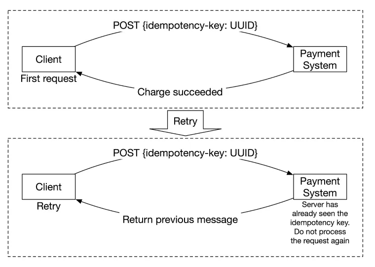

# Payment System

## 프로젝트 목표

이 프로젝트는 스타트업에서 진행했던 **결제 서비스 구축 경험**을 바탕으로 개인 프로젝트로 확장한 것이다.  
**아마존이나 쿠팡과 같은 온라인 전자상거래 플랫폼**에서 물건을 구매할 때 사용하는 결제 시스템을 직접 설계하고 구현하는 것이 목표다.

이를 통해 **온라인 상거래에서 필수적인 결제 프로세스를 이해**하고, 실제 서비스에서 활용될 수 있는 **결제 시스템의 아키텍처와 기술 스택**을 다룬다.

---

## Requirements 정의

결제 시스템을 구축하기 위한 주요 요구사항은 다음과 같다:

- **결제 방식**: Toss Payments의 **위젯 방식**을 사용하여 결제를 처리한다.
- **서비스 범위**: 글로벌 서비스가 아닌 **대한민국 내에서만 운영**되는 결제 시스템을 구축한다.
- **트래픽 고려 제외**: 트래픽 처리량에 대한 구체적인 제한을 두지 않는다.
- **보안 및 인증**: 사용자 인증이나 보안(Security)과 관련된 상세 요구사항은 포함하지 않는다.
- **신뢰성(Reliability)과 장애 허용성(Fault Tolerance)**: 일부 서비스에 장애가 발생하더라도 **결제가 올바르게 완료될 수 있도록 설계**되어야 한다.
- **데이터 일관성(Consistency)**: 결제 데이터는 **일관성을 유지**해야 하며, 동시성 이슈로 인해 데이터가 유실되지 않도록 처리해야 한다.

---

## Payment Process

결제 시스템은 기본적으로 **두 가지 흐름(Payment Flow)** 으로 구성된다.

### 1. Pay-in 플로우
- **구매자가 결제를 진행**하면, 결제 금액이 **이커머스 플랫폼의 법인 계좌로 이체**되는 과정이다.
- 신용카드, 간편결제(Toss Payments 위젯) 등의 결제 수단이 사용될 수 있다.

### 2. Pay-out 플로우
- **이커머스 플랫폼이 판매자에게 수익을 정산하여 지급**하는 과정이다.
- 법인 계좌에서 판매자의 계좌로 직접 이체되는 방식이며, **단순한 은행 거래이므로 이번 시스템에서는 별도로 설계하지 않는다.**

📌 **결제 흐름 다이어그램:**  


이러한 결제 프로세스를 기반으로, **신뢰성(Reliability)과 장애 허용성(Fault Tolerance)** 을 고려하여 안정적인 결제 시스템을 설계한다.

---

## 시스템 설계 (System Architecture)

📌 **결제 시스템의 기본 구성 요소**  


### **주요 컴포넌트**
- **Payment Event**: 사용자가 결제를 요청하는 이벤트
- **Payment Service**: 결제 요청을 처리하고 필요한 데이터를 관리하는 서비스
- **Payment Order**: 결제 요청을 실행하기 위한 주문 정보
- **Payment Executor**: 실제 결제 요청을 외부 PSP(Payment Service Provider)로 전달하여 처리하는 컴포넌트
- **Ledger**: 거래 기록을 저장하는 데이터 저장소
- **Wallet**: 사용자 지갑 관련 데이터를 관리하는 모듈

📌 **PG(Payment Gateway) 연동 방식**  
위 시스템은 사용자의 **카드 정보를 직접 저장하지 않으며**, 대신 **PG사(Toss Payments)와 연계하여 결제를 처리하는 형태**로 동작한다.

---

## PG-Integrated Payment Flow

PG사(Toss Payments)와 연동하여 결제를 처리하는 전체적인 흐름은 다음과 같다.

📌 **PG 연동 결제 흐름:**  


### **결제 흐름 단계**
1. **Checkout** → 사용자가 '구매하기' 버튼을 클릭
2. **Display** → Payment Service에서 Payment Event 생성 후 결제 페이지 표시
3. **Start Payment** → 사용자가 "결제하기" 버튼 클릭 후 PSP(Toss Payments) 결제 창 활성화
4. **Payment Authentication Result** → PSP에서 결제 인증 진행
5. **Redirect** → 결제 성공/실패 여부에 따라 결과 페이지로 이동
6. **Notify** → Payment Service에 결제 성공 여부 전달
7. **Request** → Payment Service가 PSP에 결제 승인 요청
8. **Payment Confirm Result** → PSP가 결제 승인 결과를 반환
9. **Send Response** → 사용자에게 결제 승인 결과 전달
10. **Send Event** → 결제 승인 이벤트 발생 후 후속 처리 진행
11. **Complete Payment Event** → 모든 결제 관련 후속 작업 완료 후 종료

이러한 방식으로 결제를 처리하면 **보안성, 신뢰성(Reliability), 장애 허용성(Fault Tolerance)** 을 확보하면서도 **PG사를 활용하여 민감한 결제 정보 저장을 피할 수 있다.**

---

## 시스템 설계: Deep Dive

### **Database 선택**
- 일반적인 결제 시스템에서는 **성능보다 데이터 무결성이 더 중요**하다.
- 확장성을 고려해야 하지만, **초기에는 관계형 데이터베이스(RDBMS)를 활용하는 것이 적합**하다.
- **트랜잭션 일관성을 보장하는 ACID 지원 데이터베이스를 선택**해야 한다.

### **Microservice vs Monolithic**

📌 **마이크로서비스(Microservice)의 장단점**

✅ **장점**
- 개별 서비스가 독립적으로 배포 및 운영될 수 있어 확장성이 뛰어남
- 한 서비스의 장애를 격리할 수 있어 결제 시스템 전체가 다운되는 것을 방지할 수 있음

❌ **단점**
- 운영 복잡성이 증가하며, 네트워크 통신 비용이 발생
- 모니터링과 디버깅이 어렵고 요청 추적이 까다로움

📌 **모놀리식(Monolithic)의 장단점**

✅ **장점**
- 운영이 단순하고, 단일 애플리케이션으로 배포 및 관리 가능
- 네트워크 통신이 없어 성능이 상대적으로 우수함
- 디버깅 및 테스팅이 용이하여 개발 속도를 높일 수 있음

❌ **단점**
- SPOF(Single Point Of Failure) 문제가 발생할 가능성이 있음
- 서비스가 커질수록 코드베이스가 복잡해지고 유지보수가 어려워질 수 있음

📌 **이번 프로젝트에서는 '모놀리식 아키텍처'를 선택했다.**  
✅ **이유**:
1. **개발 및 배포 단순성** → 초기 시스템 구축 및 유지보수가 용이함
2. **트랜잭션 관리 용이성** → 단일 DB 내에서 트랜잭션 처리 가능
3. **MVP 개발 적합** → 빠른 개발과 유지보수가 가능

### Idempotency (멱등성)

멱등성 처리는 **같은 요청이 여러 번 들어와도 최대 한 번만 실행되도록 보장하는 방식**이다.

📌 **Idempotency 적용 예시**
```bash
POST /payment
Headers: { "Idempotency-Key": "123e4567-e89b-12d3-a456-426614174000" }
```

📌 **Idempotency 처리 흐름:**  


### Reliability 와 Fault Tolerance

#### **Handling Failed Payment Using Retry**

📌 **결제 상태 전이 다이어그램**  


✅ **자동 재시도(Retry) 전략**
- **Exponential Backoff 적용** → 첫 번째 재시도는 2초 후, 두 번째 재시도는 4초 후...
- **최대 재시도 횟수 설정** → 5번까지 재시도 후 실패 시 최종적으로 결제 실패 처리
- **Idempotency 적용** → 동일한 idempotency-key를 사용하여 중복 결제 요청 방지

이러한 방식으로 **결제 시스템의 안정성을 높이고, 장애 상황에서도 정상적으로 복구할 수 있도록 설계**했다. 🚀

---

## Payment System ERD

📌 **ER 다이어그램**


### 1. `product`
- **설명**: 판매자가 등록한 상품 정보를 저장하는 테이블
- **주요 컬럼**:
    - `id` (bigint, PK): 상품 ID
    - `name` (varchar(256)): 상품 이름
    - `amount` (bigint): 상품 가격
    - `quantity` (int): 상품 수량
    - `seller_id` (bigint, FK): 판매자 ID

### 2. `payment_event`
- **설명**: 결제 요청 이벤트를 관리하는 테이블
- **주요 컬럼**:
    - `id` (bigint, PK): 결제 이벤트 ID
    - `buyer_id` (bigint, FK): 구매자 ID
    - `order_id` (varchar(255)): 주문 ID
    - `payment_key` (varchar(255)): 결제 키 (PSP에서 반환되는 고유 키)
    - `method` (enum): 결제 방식 (예: easy_pay, normal 등)
    - `is_payment_done` (bit): 결제 완료 여부
    - `approved_at` (datetime): 결제 승인 시간
    - `psp_raw_data` (text): PSP 응답 데이터 원본
    - `updated_at` (datetime): 마지막 업데이트 시간

### 3. `payment_order`
- **설명**: 개별 주문과 결제 상태를 관리하는 테이블
- **주요 컬럼**:
    - `id` (bigint, PK): 주문 ID
    - `payment_event_id` (bigint, FK): 결제 이벤트 ID
    - `order_id` (varchar(255)): 주문 고유 식별자
    - `product_id` (bigint, FK): 상품 ID
    - `seller_id` (bigint, FK): 판매자 ID
    - `amount` (bigint): 주문 금액
    - `payment_order_status` (enum): 주문 상태 (executing, failure, not_started, success, unknown)
    - `failed_count` (int): 실패 횟수
    - `failed_threshold` (int): 최대 실패 허용 횟수
    - `is_ledger_updated` (bit): Ledger 업데이트 여부
    - `is_wallet_updated` (bit): Wallet 업데이트 여부
    - `created_at` (datetime): 생성 시간
    - `updated_at` (datetime): 마지막 업데이트 시간

### 4. `payment_order_history`
- **설명**: 주문 상태 변경 이력을 저장하는 테이블
- **주요 컬럼**:
    - `id` (bigint, PK): 기록 ID
    - `payment_order_id` (bigint, FK): 관련 주문 ID
    - `previous_status` (enum): 이전 주문 상태
    - `new_status` (enum): 변경된 주문 상태
    - `reason` (varchar(255)): 변경 이유
    - `changed_by` (varchar(256)): 변경한 주체 (시스템 또는 관리자 등)
    - `created_at` (datetime): 변경된 시간

### 5. `ledger`
- **설명**: 거래 내역을 기록하는 Ledger 시스템
- **주요 컬럼**:
    - `id` (bigint, PK): Ledger ID
    - `account_id` (bigint): 관련 계정 ID
    - `amount` (bigint): 거래 금액
    - `type` (enum): 거래 유형 (credit, debit)
    - `transaction_id` (bigint, FK): 거래 ID
    - `created_at` (datetime): 생성 시간

### 6. `ledger_transaction`
- **설명**: Ledger 내 개별 거래를 추적하는 테이블
- **주요 컬럼**:
    - `id` (bigint, PK): 거래 ID
    - `transaction_id` (bigint, FK): 관련 Ledger 거래 ID
    - `description` (varchar(255)): 거래 설명
    - `idempotency_key` (varchar(255)): 멱등성 키 (중복 방지)
    - `order_id` (bigint, FK): 관련 주문 ID
    - `reference_id` (bigint): 참조 ID
    - `reference_type` (tinyint): 참조 유형
    - `created_at` (datetime): 생성 시간

### 7. `wallet`
- **설명**: 사용자의 지갑 정보를 저장하는 테이블
- **주요 컬럼**:
    - `id` (bigint, PK): 지갑 ID
    - `user_id` (bigint, FK): 사용자 ID
    - `balance` (bigint): 지갑 잔액
    - `version` (bigint): Optimistic Locking을 위한 버전
    - `created_at` (datetime): 생성 시간
    - `updated_at` (datetime): 마지막 업데이트 시간

### 8. `wallet_transaction`
- **설명**: Wallet에서 발생한 거래 내역을 관리하는 테이블
- **주요 컬럼**:
    - `id` (bigint, PK): 거래 ID
    - `wallet_id` (bigint, FK): 관련 지갑 ID
    - `amount` (bigint): 거래 금액
    - `type` (enum): 거래 유형 (deposit, withdraw)
    - `reference_type` (enum): 참조 유형 (payment, refund)
    - `order_id` (bigint, FK): 관련 주문 ID
    - `idempotency_key` (varchar(255)): 멱등성 키 (중복 방지)
    - `created_at` (datetime): 생성 시간
    - `updated_at` (datetime): 마지막 업데이트 시간

---

# 최종 시스템 아키텍처

## Technology Stack
이 결제 시스템은 다음과 같은 주요 기술 스택을 기반으로 구축되었다:

| Technology  | Description |
|-------------|------------------------------------------------|
| **Toss Payments** | 결제 게이트웨이(PG)로 사용 |
| **Spring Boot** | 애플리케이션의 백엔드 프레임워크 |
| **JPA** | 데이터베이스 ORM(Object-Relational Mapping) 처리 |
| **Thymeleaf** | 템플릿 엔진을 이용한 프론트엔드 렌더링 |
| **MySQL** | 결제, 거래 및 사용자 데이터를 저장하는 관계형 데이터베이스 |


## 시스템 아키텍처 다이어그램
